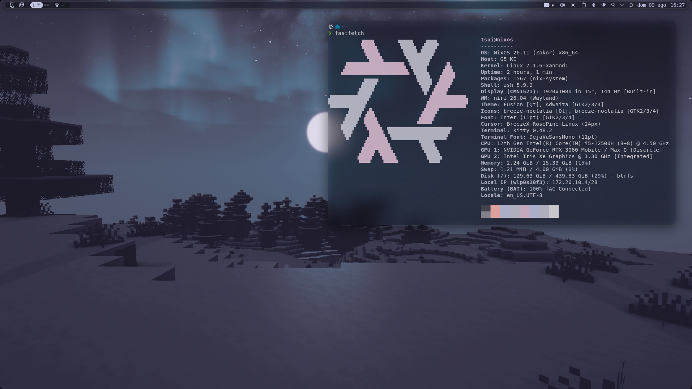
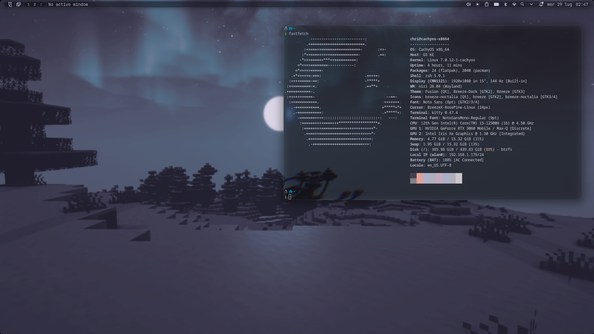

# Niri Desktop Environment Configuration with Noctalia

### Frost Mode


### Liquid Glass Mode



## 1. Underlying Utilities & Background Services

*   **niri**: Core Wayland compositor.
*   **xwayland-satellite**: Rootless X11 compatibility bridge.
*   **wl-clipboard**: Native Wayland clipboard protocol interface.
*   **cliphist**: Background daemon for clipboard history persistence.
*   **xdg-desktop-portal**: Core IPC router for sandbox bridging.
*   **xdg-desktop-portal-gnome**: Portal backend required for screen captures.
*   **xdg-desktop-portal-gtk**: Fallback portal for GTK file pickers.
*   **hypridle**: DPMS state manager.
*   **hyprlock**: GPU-accelerated screen locker.
*   **ly**: TUI display manager (login manager) supporting X11 and Wayland.
*   **noctalia-git**: Monolithic Wayland desktop shell (providing status bar, dock, application launcher, notifications, OSD, and wallpaper manager).
*   **pipewire**: Low-latency multimedia routing daemon.
*   **wireplumber**: Session and policy manager for PipeWire.
*   **brightnessctl**: Interface for sysfs backlight manipulation.
*   **networkmanager**: System daemon for network states.
*   **bluez**: Core Bluetooth protocol stack.
*   **bluez-utils**: CLI utilities for Bluetooth management.
*   **nwg-look**: GTK visual settings injector.
*   **qt5ct**: Qt5 environment variable injector.
*   **qt6ct**: Qt6 environment variable injector.
*   **ttf-jetbrains-mono-nerd**: Base typography and icon glyphs.
*   **noto-fonts**: System UI fallback typography.
*   **playerctl**: MPRIS command-line controller for media keys.
*   **zsh**: Advanced interactive shell parser.
*   **zsh-theme-powerlevel10k**: Fast, flexible Powerlevel10k prompt engine for Zsh.
*   **zsh-autosuggestions**: Fish-like autocomplete predictions for Zsh.
*   **zsh-syntax-highlighting**: Live shell syntax highlighting.

---

## 2. User-Facing GUI & TUI Applications

*   **nautilus**: Graphical file manager.
*   **dolphin**: Qt-based graphical file manager.
*   **pcmanfm-qt**: Qt-based lightweight file manager (handling desktop icons and files).
*   **file-roller**: Graphical archive manager.
*   **zip, unzip, p7zip, unrar**: Compression algorithms.
*   **yazi**: Asynchronous terminal file manager.
*   **kitty**: GPU-accelerated Wayland terminal emulator.
*   **zed**: Vulkan-rendered code editor.
*   **helium-browser-bin**: Minimal web browser.
*   **ungoogled-chromium-bin**: Privacy-focused Chromium web browser.
*   **rose-pine-cursor**: Rosé Pine & Rosé Pine Dawn cursor theme.
*   **discord**: Electron-based communication client.
*   **pwvucontrol**: Graphical PipeWire audio router.
*   **network-manager-applet**: System tray interface for Wi-Fi.
*   **blueman**: System tray interface for Bluetooth.
*   **nirimod-git**: GTK4 graphical settings application for Niri.
*   **niri-display-manager**: PySide6/QML graphical monitor layout and settings manager.
*   **grim**: Frame grabber for the Wayland buffer.
*   **slurp**: Coordinate mapping utility for screen captures.

---

## The Master Deployment Pipeline

Execute these steps to bootstrap the system, clone the dotfiles repository, install packages, configure user groups, and enable essential services.

### Step 1: System Bootstrapping (Run this first on a clean TTY system)
```bash
# Install git and base-devel (needed for AUR compiling)
sudo pacman -S --needed base-devel git

# Bootstrap paru (AUR helper)
git clone https://aur.archlinux.org/paru-bin.git
cd paru-bin && makepkg -si --noconfirm
cd .. && rm -rf paru-bin

# Clone your dotfiles repository to your home folder
git clone https://github.com/cerebroleso/rice.git ~/dotfiles
```

### Step 2: Install Packages & Configure Services
```bash
# Update system and install Niri, Ly, and Noctalia Environment packages
paru -S niri xwayland-satellite wl-clipboard cliphist xdg-desktop-portal \
  xdg-desktop-portal-gnome xdg-desktop-portal-gtk hypridle hyprlock pipewire \
  wireplumber brightnessctl networkmanager bluez bluez-utils nwg-look qt5ct qt6ct \
  ttf-jetbrains-mono-nerd noto-fonts nautilus dolphin pcmanfm-qt file-roller zip unzip 7zip \
  unrar yazi kitty zed helium-browser-bin ungoogled-chromium-bin discord pwvucontrol \
  network-manager-applet blueman grim slurp hyprutils-git hyprlang-git \
  hyprwayland-scanner-git aquamarine-git hyprgraphics-git hyprtoolkit-git \
  nirimod-git niri-display-manager playerctl noctalia-git ly rose-pine-cursor \
  zsh zsh-theme-powerlevel10k zsh-autosuggestions zsh-syntax-highlighting zsh-completions

# Enable the Ly TUI display manager for system startup login
sudo systemctl enable ly.service

# Add current user to video and input groups to allow Wayland/compositor seat control
sudo usermod -aG video,input $USER

# Enable user services for multimedia routing
systemctl --user enable wireplumber.service
systemctl --user enable pipewire.service

# Ensure Wayland session entries directory exists
sudo mkdir -p /usr/share/wayland-sessions

# Inject desktop entry for Niri (so Ly can detect it)
cat << 'EOF' | sudo tee /usr/share/wayland-sessions/niri.desktop
[Desktop Entry]
Name=Niri
Exec=niri-session
Type=Application
EOF

# Scaffold configurations directories
mkdir -p ~/.config/niri/dms
```

### Step 3: Starting the Session

You can launch your desktop environment in one of two ways:

1. **Via the Ly Display Manager (Recommended):**
   Simply reboot your system:
   ```bash
   sudo reboot
   ```
   Upon boot, the Ly TUI login manager will appear. Enter your credentials, select **Niri** as the session (use the arrow keys to navigate), and login.

2. **Manual Launch from TTY (Alternative):**
   If you want to launch Niri directly from your current terminal session without rebooting:
   ```bash
   niri-session
   ```

---

## Dotfiles Symlinking

Run this block to link the non-legacy configurations from your repository to your `~/.config` directory. It safely handles pre-existing files by backing them up to `<folder>.bak` before creating the symlinks.

```bash
# Ensure ~/.config exists
mkdir -p ~/.config

# Symlink active configuration folders from the repository (excluding legacy fuzzel, waybar, vicinae)
for folder in niri noctalia gtk-3.0 gtk-4.0 qt5ct qt6ct pcmanfm-qt kitty; do
    if [ -e ~/.config/"$folder" ] && [ ! -L ~/.config/"$folder" ]; then
        echo "Backing up existing ~/.config/$folder to ~/.config/${folder}.bak"
        mv ~/.config/"$folder" ~/.config/"$folder".bak
    elif [ -L ~/.config/"$folder" ]; then
        rm -rf ~/.config/"$folder"
    fi
    ln -sf ~/dotfiles/.config/"$folder" ~/.config/"$folder"
done

# Ensure local state directory for Noctalia overrides exists
mkdir -p ~/.local/state/noctalia

# Symlink Noctalia GUI override settings to keep them synced in the repo
if [ -e ~/.local/state/noctalia/settings.toml ] && [ ! -L ~/.local/state/noctalia/settings.toml ]; then
    echo "Backing up existing ~/.local/state/noctalia/settings.toml to ~/.local/state/noctalia/settings.toml.bak"
    mv ~/.local/state/noctalia/settings.toml ~/.local/state/noctalia/settings.toml.bak
elif [ -L ~/.local/state/noctalia/settings.toml ]; then
    rm -f ~/.local/state/noctalia/settings.toml
fi
ln -sf ~/dotfiles/.config/noctalia/settings.toml ~/.local/state/noctalia/settings.toml

# Symlink IDE settings.json for frameless titlebars
mkdir -p ~/.config/"Antigravity IDE"/User ~/.config/"Code - OSS"/User
ln -sf ~/dotfiles/.config/"Antigravity IDE"/User/settings.json ~/.config/"Antigravity IDE"/User/settings.json
ln -sf ~/dotfiles/.config/"Code - OSS"/User/settings.json ~/.config/"Code - OSS"/User/settings.json

# Symlink Zsh shell and Powerlevel10k prompt configuration files
ln -sf ~/dotfiles/.zshrc ~/.zshrc
ln -sf ~/dotfiles/.p10k.zsh ~/.p10k.zsh

# Install WhiteSur icon theme locally if not already present (needed for macOS folders & extensions)
if [ ! -d ~/.local/share/icons/WhiteSur ]; then
    echo "Installing WhiteSur icon theme..."
    git clone --depth 1 https://github.com/vinceliuice/WhiteSur-icon-theme.git /tmp/WhiteSur-icon-theme
    /tmp/WhiteSur-icon-theme/install.sh
    rm -rf /tmp/WhiteSur-icon-theme
fi

# Set GTK icon theme and cursor theme to Rosé Pine
gsettings set org.gnome.desktop.interface icon-theme 'breeze-noctalia'
gsettings set org.gnome.desktop.interface cursor-theme 'BreezeX-RosePine-Linux'
gsettings set org.gnome.desktop.wm.preferences button-layout ''

# Make hook script executable and initialize the dynamic folder icons theme
chmod +x ~/dotfiles/.config/noctalia/colors_changed.sh
~/dotfiles/.config/noctalia/colors_changed.sh
```

## Building Patched Niri with Liquid Glass/Refraction Effects

This setup supports a custom patch that ports the Liquid Glass / Refraction effects to the Niri window manager (specifically tested on commit `0777769e719b7c9b7c980d4ea66288bfbb4da5b3`).

### Option 1: Automatic Arch Linux Package (Recommended)

To compile and package it into an installable `.pkg.tar.zst` package replacing the standard `niri` repository package:

```bash
# Go to the package directory
cd ~/dotfiles/experimental/niri-glass-pkgbuild

# Compile, package and install
makepkg -si
```

---

### Option 2: Manual Clone, Patch, and Build

If you want to manually set up the source tree and apply the patch:

1. **Clone Niri and checkout the target commit**:
   ```bash
   git clone https://github.com/niri-wm/niri.git
   cd niri
   git checkout 0777769e719b7c9b7c980d4ea66288bfbb4da5b3
   ```

2. **Apply the patch**:
   ```bash
   git apply ~/dotfiles/experimental/liquid-glass.patch
   ```

3. **Build the release binary**:
   ```bash
   cargo build --release
   ```

---

## Toggling Liquid Glass Configuration

You can easily switch between standard rendering (stock Niri) and the Liquid Glass effect.

The active configuration remains at `~/.config/niri/` (symlinked from `~/dotfiles/.config/niri/`). The repository contains two reference configurations:
- `~/dotfiles/stock_niri/`: Duplicate copy of original configuration files.
- `~/dotfiles/glass_niri/`: Modified version containing the `liquid-glass` refraction blocks.

To toggle back and forth between standard and glass modes, run:

```bash
~/dotfiles/toggle-glass.sh
```

This will copy the files from the selected mode into your active `~/.config/niri` folder and trigger an automatic configuration reload.

---

## Global Frameless & CSD-Free Aesthetic Architecture

This repository enforces a borderless, minimalist window aesthetic across GTK, Electron, and Wayland applications by stripping window title bars and window control buttons (`_`, `[]`, `X`).

### Key Modifications Enforced:

1. **Global Master Environment Flags** (Configured in [config.kdl](file:///home/chri/dotfiles/.config/niri/config.kdl#L126-L132) & `~/.config/environment.d/10-no-csd.conf`):
   * `GTK_CSD="0"`: Strips Client-Side Decoration (CSD) titlebars globally across GTK3, GTK4, and GTK-based Electron applications.
   * `ELECTRON_OZONE_PLATFORM_HINT="wayland"`: Forces Electron apps (VS Code, Antigravity IDE, Discord, Spotify) to run in native Wayland Ozone mode without fallback X11 frames.
   * `LIBDECOR_PLUGIN="dummy"`: Disables `libdecor` titlebar rendering for Wayland SDL/C++ applications.

2. **GTK Button Layout Removal**:
   * `gtk-decoration-layout=` set to empty in [gtk-3.0/settings.ini](file:///home/chri/dotfiles/.config/gtk-3.0/settings.ini#L8) and [gtk-4.0/settings.ini](file:///home/chri/dotfiles/.config/gtk-4.0/settings.ini#L7).
   * `gsettings set org.gnome.desktop.wm.preferences button-layout ''`.

3. **Electron Applications (VS Code / Antigravity IDE)**:
   * `"window.titleBarStyle": "native"` set in `settings.json` so Electron yields window decoration control to the compositor environment, resulting in frameless application windows.

---

## Keyboard Shortcuts (Keybinds)

The following tables document the keyboard shortcuts configured in [binds.kdl](file:///home/chri/dotfiles/stock_niri/dms/binds.kdl).

### Core Applications
| Keybind | Command / Action | Description |
| :--- | :--- | :--- |
| `Ctrl+Alt+T` | `spawn "kitty"` | Launch Kitty terminal |
| `Mod+T` | `spawn "kitty"` | Launch Kitty terminal |
| `Mod+W` | `spawn "helium-browser"` | Launch Helium browser |
| `Mod+D` | `spawn "zed"` | Launch Zed code editor |
| `Mod+E` | `spawn "nautilus"` | Launch Nautilus file manager |
| `Mod+Shift+E` | `spawn-sh "kitty yazi"` | Launch Yazi terminal file manager in Kitty |

### Window Management
| Keybind | Command / Action | Description |
| :--- | :--- | :--- |
| `Mod+Q` | `close-window` | Close the focused window |
| `Mod+Shift+Q` | `quit skip-confirmation=true` | Exit Niri session |
| `Mod+S` | `switch-preset-column-width` | Cycle column width presets |
| `Mod+M` | `maximize-column` | Toggle maximization of current column |
| `Mod+F` | `fullscreen-window` | Toggle fullscreen on current window |
| `Alt+Tab` | `focus-window-previous` | Focus previous window |
| `Mod+Left` | `move-column-left; set-column-width 50%` | Move column left and set width to 50% |
| `Mod+Right` | `move-column-right; set-column-width 50%` | Move column right and set width to 50% |
| `Mod+Up` | `move-window-up; set-window-height 50%` | Move window up and set height to 50% |
| `Mod+Down` | `move-window-down; set-window-height 50%` | Move window down and set height to 50% |
| `Mod+Ctrl+Left` / `Mod+H` | `focus-column-left` | Focus column to the left |
| `Mod+Ctrl+Right` / `Mod+L` | `focus-column-right` | Focus column to the right |
| `Mod+Shift+Left` / `Mod+Shift+H` | `move-column-left` | Move column left |
| `Mod+Shift+Right` / `Mod+Shift+L` | `move-column-right` | Move column right |
| `Mod+Shift+Space` / `Super + Middle Click` | `toggle-window-floating` | Toggle window floating / tiled state |
| `Super + Left Click + Drag` | Niri native move | Drag and move floating window across desktop |
| `Super + Right Click + Drag` | Niri native resize | Resize floating window with mouse cursor |
| `Mod+-` / `Mod+=` | `set-column-width -10% / +10%` | Interactively shrink / expand column width |
| `Mod+Shift+-` / `Mod+Shift+=` | `set-window-height -10% / +10%` | Interactively shrink / expand window height |

### Workspace Navigation
| Keybind | Command / Action | Description |
| :--- | :--- | :--- |
| `Mod+Ctrl+Up` / `Mod+K` | `focus-workspace-up` | Focus adjacent workspace up |
| `Mod+Ctrl+Down` / `Mod+J` | `focus-workspace-down` | Focus adjacent workspace down |
| `Mod+Shift+Up` | `move-window-to-workspace-up` | Move window to workspace up |
| `Mod+Shift+Down` | `move-window-to-workspace-down` | Move window to workspace down |
| `Mod+1` .. `Mod+9` | `focus-workspace 1..9` | Direct jump to workspace 1 through 9 |
| `Mod+Shift+1` .. `Mod+Shift+9` | `move-column-to-workspace 1..9` | Move window to workspace 1 through 9 |

### Desktop Shell & System Utilities
| Keybind | Command / Action | Description |
| :--- | :--- | :--- |
| `Mod+Space` | `noctalia msg panel-toggle launcher` | Toggle Noctalia Application Launcher |
| `Mod+V` | `noctalia msg panel-toggle clipboard` | Toggle Noctalia Clipboard History |
| `Mod+N` | `noctalia msg notifications toggleHistory` | Toggle Notification History panel |
| `Mod+Shift+L` | `noctalia msg session lock` | Lock screen via Noctalia native lock screen |
| `Mod+Shift+R` | Niri config reload | Reload Niri configuration and notify |
| `Mod+Shift+G` | `toggle-glass.sh` | Toggle Niri Liquid Glass/Refraction mode |
| `Mod+Shift+D` | `toggle-pcmanfm.sh` | Toggle desktop files/icons visibility |
| `Mod+Shift+S` / `Mod+P` | `noctalia msg screenshot-region` | Noctalia native interactive region screenshot |
| `Mod+Ctrl+P` | `noctalia msg screenshot-fullscreen` | Noctalia native fullscreen screenshot |

### Media & Hardware Controls
| Keybind | Command / Action | Description |
| :--- | :--- | :--- |
| `XF86AudioPlay` / `Pause` | `playerctl play-pause` | Play/Pause media |
| `XF86AudioNext` | `playerctl next` | Next media track |
| `XF86AudioPrev` | `playerctl previous` | Previous media track |
| `XF86AudioRaiseVolume` | `noctalia msg volume-up` | Raise audio volume |
| `XF86AudioLowerVolume` | `noctalia msg volume-down` | Lower audio volume |
| `XF86AudioMute` | `noctalia msg volume-mute` | Mute/unmute audio |
| `XF86AudioMicMute` | `noctalia msg mic-mute` | Mute/unmute microphone |
| `XF86MonBrightnessUp` | `noctalia msg brightness-up` | Increase screen brightness |
| `XF86MonBrightnessDown` | `noctalia msg brightness-down` | Decrease screen brightness |

---

## Memory Footprint & Performance

Below is an analysis of the desktop suite's memory footprint under two setups: the **Full Glass Suite** (Niri Glass + Noctalia + PCManFM-Qt) and the **Minimal Stock Suite** (Niri Stock + Noctalia, without PCManFM-Qt), and how they measure up against other Wayland desktop setups.

### 1. Real-Time Resource Breakdown

These are live metrics showing the resident set size (RSS) memory footprint of the desktop components:

#### Core Components

| Process / Component | Role / Command | RSS Memory (Full Glass) | RSS Memory (Minimal / Stock) |
| :--- | :--- | :--- | :--- |
| **Niri** | Window Manager + Compositor | **175.1 MB** (179,344 KB) | **151.4 MB** (155,044 KB) |
| **Noctalia** | Shell (Bar, Dock, Launcher, Notifier) | **180.3 MB** (184,660 KB) | **180.4 MB** (184,720 KB) |
| **PCManFM-Qt** | Desktop file manager / icons | **118.1 MB** (120,952 KB) | **0.0 MB** *(Disabled)* |
| **XWayland Satellite** | XWayland compatibility layer | **10.6 MB** (10,876 KB) | **10.6 MB** (10,876 KB) |
| **Total Core Components** | **Active base workspace footprint** | **~488.3 MB** | **~342.4 MB** |

*   **PCManFM-Qt Suspension:** Disabling the desktop icons immediately unloads the Qt6-based manager, recovering **118.1 MB** of RAM.
*   **Compositor Shader Reduction:** Disabling the Liquid Glass refraction shader (switching to standard window borders) drops the compositor footprint by **23.7 MB** by cleaning up the active graphics pipeline, glow/fringing textures, and screen-behind buffers.

### 3. Comparison with Other Environments

Here is how these setups compare to other popular desktop choices on clean boot:

| Environment | Compositor | Panels / Bars | Launcher & Services | Desktop Manager | Total Startup RSS |
| :--- | :--- | :--- | :--- | :--- | :--- |
| **The Suite (Minimal / Stock)** | **Niri Stock** (~151MB) | **Noctalia** (~180MB) | Included in Noctalia | None (No icons) | **~342 MB** |
| **The Suite (Full Glass)** | **Niri Glass** (~175MB) | **Noctalia** (~180MB) | Included in Noctalia | **PCManFM-Qt** (~118MB) | **~488 MB** |
| **Sway Minimal** | Sway (~60MB) | Waybar (~55MB) | Fuzzel + Mako (~35MB) | None (No icons) | **~150 MB** |
| **Hyprland Modular** | Hyprland (~90MB) | Waybar (~60MB) | Rofi + Dunst + Swbg (~95MB) | None (No icons) | **~245 MB** |
| **KDE Plasma 6** | KWin (~120MB) | Plasmashell (~300MB) | KRunner + Daemons (~180MB) | Desktop Icons (~100MB) | **~700 MB** |
| **GNOME 46** | Mutter (~150MB) | GNOME Shell (~400MB) | Included in Shell | Extensions (~80MB) | **~630 MB - 900 MB** |

### 4. Design & Performance Insights

#### Why Noctalia is Incredibly Efficient
In a typical modular window manager configuration, multiple separate daemons are executed (e.g. Waybar + SwayNC + Fuzzel + SwayOSD + SWWW + Dock apps). This results in duplicated systemd tasks and repeated copying of Qt/GTK shared libraries in RAM.
By rolling these tools into a single, cohesive binary, **Noctalia** minimizes context switching, shares a single memory pool, and maps standard libraries only once. This saves roughly **80 MB to 150 MB** of system overhead while providing a seamless, unified shell.

#### The Cost of "Glass"
Running **Liquid Glass** in Niri requires real-time computations for background refraction, adaptive dimming, borders, glows, and fringing. These shaders force the compositor to retain additional window-behind texture buffers in GPU/CPU RAM, which is why Niri Glass uses **23.7 MB** more than the stock configuration.

---

## NixOS Deployment & Flake Architecture Guide

This section describes how to deploy and manage this dotfiles repository on **NixOS** using Flakes, Home Manager (Strategy 2 `mkOutOfStoreSymlink`), and the **CachyOS kernel**.

### 1. NixOS System Flake Setup (`flake.nix`)

NixOS allows declaring both laptop and desktop systems with the optimized CachyOS Linux kernel provided by the `chaotic-nyx` Flake input:

```nix
{
  description = "Niri Desktop Environment on NixOS with CachyOS Kernel";

  inputs = {
    nixpkgs.url = "github:nixos/nixpkgs/nixos-unstable";
    chaotic.url = "github:chaotic-cx/nyx"; # CachyOS kernel & optimized packages
    home-manager = {
      url = "github:nix-community/home-manager";
      inputs.nixpkgs.follows = "nixpkgs";
    };
  };

  outputs = { self, nixpkgs, chaotic, home-manager, ... }: {
    nixosConfigurations = {
      # Laptop Configuration
      laptop = nixpkgs.lib.nixosSystem {
        system = "x86_64-linux";
        modules = [
          chaotic.nixosModules.default
          ./hardware-configuration.nix
          ./configuration.nix
          home-manager.nixosModules.home-manager
          {
            home-manager.useGlobalPkgs = true;
            home-manager.useUserPackages = true;
            home-manager.users.tsui = import ./home.nix;
          }
        ];
      };
    };
  };
}
```

### 2. CachyOS Kernel & Hardware Configuration (`configuration.nix`)

Enable the CachyOS kernel, Niri Wayland compositor, audio, and graphics in `configuration.nix`:

```nix
{ config, pkgs, ... }:

{
  # Use CachyOS optimized kernel
  boot.kernelPackages = pkgs.linuxPackages_cachyos;

  # Enable Wayland graphics & 32-bit drivers
  hardware.graphics = {
    enable = true;
    enable32Bit = true;
  };

  # Sound & Bluetooth
  services.pipewire = {
    enable = true;
    alsa.enable = true;
    pulse.enable = true;
  };
  hardware.bluetooth.enable = true;

  # Enable Flatpak (for Bottles / Steam compatibility)
  services.flatpak.enable = true;

  # --- Core Base Programs ---
  environment.systemPackages = with pkgs; [
    # Desktop Environment & Ricing
    niri kitty waybar noctalia nwg-look satty grim slurp swayosd playerctl brightnessctl cliphist
    wl-clipboard libnotify qt5ct qt6ct

    # Productivity, Media & Viewers
    firefox chromium discord qbittorrent zathura file-roller loupe meld qdirstat gparted xorg.xhost
    pavucontrol dbeaver-bin tailscale nmap lshw pciutils usbutils

    # Editors & CLI Utilities
    git zsh vscode-fhs zed-editor neovim btop ripgrep procps gnused rsync p7zip unzip

    # --- Hardware-Specific & Laptop Tuning (Omit on other machines) ---
    tuxedo-control-center
    penguin-burner
    ddcutil

    # --- Virtualization Stack & Windows Runners ---
    bottles virt-manager qemu_full libvirt ebtables dnsmasq OVMF

    # --- Gaming & Emulators ---
    steam ryujinx rpcs3 pcsx2 moonlight-qt mangohud vkbasalt
  ];

  # Set default shell to Zsh
  users.users.tsui = {
    isNormalUser = true;
    extraGroups = [ "wheel" "video" "input" "libvirtd" ];
    shell = pkgs.zsh;
  };
}
```

### 3. Home Manager Dotfiles Symlinking (`home.nix`)

Instead of manual symlinking scripts, Home Manager connects your `~/dotfiles` repository directly to `~/.config/` using `mkOutOfStoreSymlink`. 

Because `mkOutOfStoreSymlink` targets your cloned repository in regular user home space, **bash scripts like `toggle-glass.sh` and `toggle-pcmanfm.sh` and Noctalia color scheme generators continue to edit files seamlessly at runtime without read-only errors**:

```nix
{ config, pkgs, ... }:

let
  dotfilesDir = "${config.home.homeDirectory}/dotfiles";
  mkSymlink = path: config.lib.file.mkOutOfStoreSymlink "${dotfilesDir}/${path}";
in
{
  home.username = "tsui"; # Set your NixOS username here
  home.homeDirectory = "/home/${config.home.username}";
  home.stateVersion = "24.05";

  # Symlink active dotfiles configs live into ~/.config
  xdg.configFile."niri".source = mkSymlink ".config/niri";
  xdg.configFile."noctalia".source = mkSymlink ".config/noctalia";
  xdg.configFile."gtk-3.0".source = mkSymlink ".config/gtk-3.0";
  xdg.configFile."gtk-4.0".source = mkSymlink ".config/gtk-4.0";
  xdg.configFile."qt5ct".source = mkSymlink ".config/qt5ct";
  xdg.configFile."qt6ct".source = mkSymlink ".config/qt6ct";
  xdg.configFile."pcmanfm-qt".source = mkSymlink ".config/pcmanfm-qt";
  xdg.configFile."kitty".source = mkSymlink ".config/kitty";
  
  # Symlink Shell configs
  home.file.".zshrc".source = mkSymlink ".zshrc";
  home.file.".p10k.zsh".source = mkSymlink ".p10k.zsh";

  # Qt Engine integration
  qt = {
    enable = true;
    platformTheme.name = "qt5ct";
    style.name = "adwaita-dark";
  };
}
```

### 4. Deploying on NixOS

To deploy this configuration on a fresh NixOS machine:

```bash
# 1. Clone your dotfiles repository
git clone https://github.com/cerebroleso/rice.git ~/dotfiles

# 2. Fix hardcoded paths for your NixOS username
# Noctalia and Qt5ct/Qt6ct require absolute paths (no tilde expansion).
sed -i "s|/home/chri|$HOME|g" \
  ~/dotfiles/.config/noctalia/settings.toml \
  ~/dotfiles/.config/noctalia/config.toml \
  ~/dotfiles/.config/qt5ct/qt5ct.conf \
  ~/dotfiles/.config/qt6ct/qt6ct.conf

# 3. Rebuild NixOS System & Home Manager
sudo nixos-rebuild switch --flake ~/dotfiles#laptop

# 4. Initialize Noctalia Dynamic Folder Colors
chmod +x ~/dotfiles/.config/noctalia/colors_changed.sh
~/dotfiles/.config/noctalia/colors_changed.sh
```

---

### 5. Building Patched Niri with Liquid Glass / Refraction Effects on NixOS

On Arch, `makepkg` compiles the patch using `/usr/include` headers. On NixOS, you have two methods to build Niri with `experimental/liquid-glass.patch`:

#### Method A: Pure Declarative Nix Override (Recommended 🏆)
In your NixOS configuration (`configuration.nix` or `flake.nix`), override the default `niri` package to apply your patch automatically during `nixos-rebuild switch`:

```nix
environment.systemPackages = [
  (pkgs.niri.overrideAttrs (oldAttrs: {
    src = pkgs.fetchFromGitHub {
      owner = "niri-wm";
      repo = "niri";
      rev = "0777769e719b7c9b7c980d4ea66288bfbb4da5b3";
      hash = "sha256-0000000000000000000000000000000000000000000="; # Update with actual hash
    };
    patches = (oldAttrs.patches or []) ++ [
      ./experimental/liquid-glass.patch
    ];
  }))
];
```
Nix will automatically patch, compile, link all Wayland/Mesa C-libraries, and place the resulting Liquid Glass Niri binary in your system PATH.

#### Method B: Manual Cargo Build via `nix-shell`
If you want to manually run `cargo build --release` inside the `niri` source directory, drop into a Nix development shell to provide `pkg-config`, `libwayland`, `pango`, `cairo`, and `libxkbcommon`:

```bash
# Drop into Nix dev shell with all Wayland build dependencies
nix-shell -p cargo rustc pkg-config wayland pango cairo libxkbcommon mesa libinput

# Clone Niri and checkout patched commit
git clone https://github.com/niri-wm/niri.git
cd niri
git checkout 0777769e719b7c9b7c980d4ea66288bfbb4da5b3

# Apply Liquid Glass patch & build
git apply ~/dotfiles/experimental/liquid-glass.patch
cargo build --release
```


